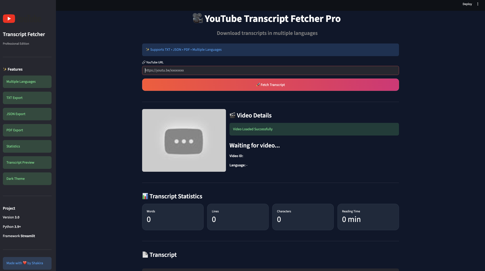
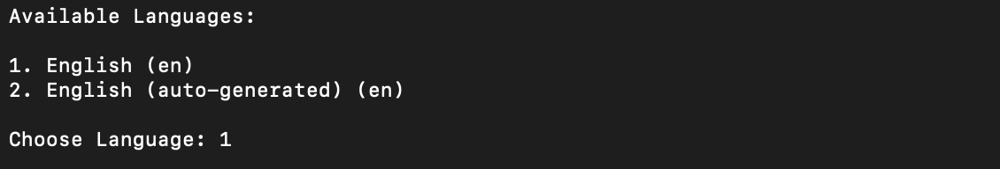
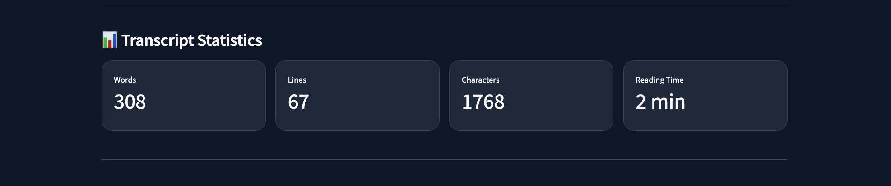

# 🎥 YouTube Transcript Fetcher Pro


A professional Python application that downloads transcripts from YouTube videos and exports them into multiple formats such as **TXT**, **JSON**, and **PDF**. The application also supports multiple transcript languages, detailed transcript statistics, logging, and a modular architecture.

---

# 📖 About

YouTube Transcript Fetcher Pro is a command-line application developed using Python.

It allows users to:

- Download transcripts from YouTube videos
- Select transcript language (if multiple languages are available)
- Save transcripts as TXT, JSON, and PDF
- View transcript statistics
- Automatically create log files
- Handle errors gracefully
- Learn real-world software engineering concepts through a modular project structure

This project was built as part of learning **Professional Python Development** and follows software engineering best practices.

---

# ✨ Features

✅ Download transcripts from YouTube

✅ Multi-language transcript support

✅ Automatic YouTube URL parsing

✅ Export transcript as TXT

✅ Export transcript as JSON

✅ Export transcript as PDF

✅ Transcript statistics

- Word Count
- Character Count
- Line Count
- Estimated Reading Time

✅ Logging system

✅ Exception handling

✅ Clean modular architecture

✅ Configuration management

✅ GitHub ready project

---

# 📸 Screenshots

## Home Screen



---

## Language Selection



---

## Transcript Statistics



---

# 📂 Project Structure

```text
youtube-transcript-fetcher/
│
├── main.py
├── transcript.py
├── youtube.py
├── utils.py
├── file_handler.py
├── pdf_exporter.py
├── statistics.py
├── logger.py
├── config.py
├── exceptions.py
├── requirements.txt
├── README.md
├── LICENSE
├── .gitignore
│
├── logs/
│
├── screenshots/
│
├── transcripts/
│
└── venv/
```

---

# ⚙ Installation

Clone the repository

```bash
git clone https://github.com/shakee19/youtube-transcript-fetcher.git
```

Move into the project

```bash
cd youtube-transcript-fetcher
```

Create a virtual environment

```bash
python3 -m venv venv
```

Activate it

### macOS / Linux

```bash
source venv/bin/activate
```

### Windows

```bash
venv\Scripts\activate
```

Install dependencies

```bash
pip3 install -r requirements.txt
```

---

# ▶ Usage

Run the application

```bash
python3 main.py
```

Example

```text
Enter YouTube URL:

https://youtu.be/dQw4w9WgXcQ
```

Choose transcript language

```text
1. English
2. Hindi
3. Kannada
```

The application downloads the transcript and saves

- TXT
- JSON
- PDF

inside the **transcripts/** folder.

---

# 📊 Sample Output

```text
============================================================
        YouTube Transcript Fetcher Pro
            Version 1.0.0
============================================================

Fetching available languages...

Downloading transcript...

Transcript Statistics

Words : 5421

Characters : 28764

Lines : 410

Reading Time : 22 minutes

Download Successful
```

---

# 📁 Output Files

```
transcripts/

Python Tutorial.txt

Python Tutorial.json

Python Tutorial.pdf
```

---

# 📦 Technologies Used

- Python 3
- YouTube Transcript API
- Requests
- ReportLab
- JSON
- Logging
- Git
- GitHub

---

# 🧠 Concepts Learned

This project demonstrates:

- Modular Programming
- REST API Integration
- JSON Parsing
- File Handling
- Exception Handling
- Logging
- Configuration Management
- PDF Generation
- Statistics Processing
- Professional Project Structure
- Virtual Environments
- Git & GitHub Workflow

---

# 🚀 Future Improvements

- Search inside transcript

- Batch transcript downloader

- GUI version using Tkinter

- Web version using Flask

- Transcript summarization using AI

- Keyword extraction

- Subtitle (.srt) export

- Automatic translation

---

# 🤝 Contributing

Contributions are welcome.

If you'd like to improve this project:

1. Fork the repository

2. Create a new branch

3. Commit your changes

4. Open a Pull Request

---

# 📜 License

This project is licensed under the MIT License.

---

# 👩‍💻 Author

**Shakira**

GitHub: [@shakee19](https://github.com/shakee19)

---

⭐ If you found this project useful, consider giving it a Star.