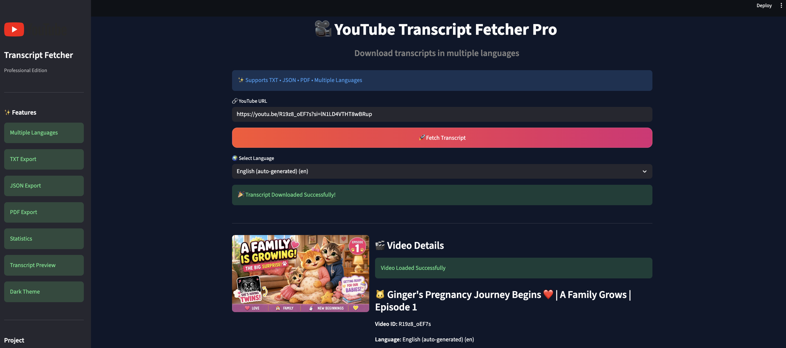
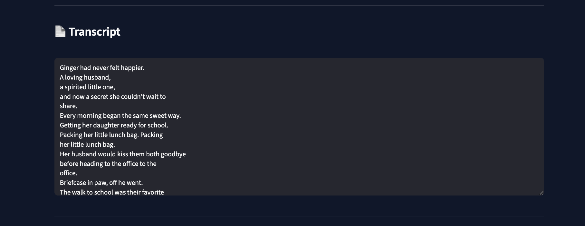
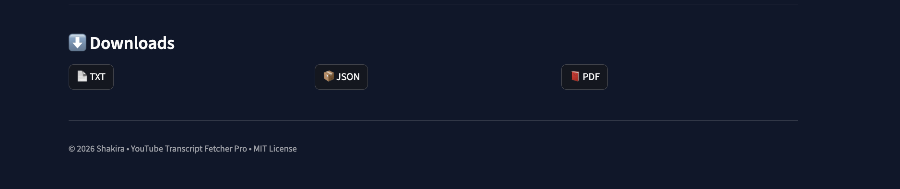

# 🎥 YouTube Transcript Fetcher Pro

<div align="center">


### A modern Streamlit application to fetch YouTube transcripts in multiple languages and export them as TXT, JSON, and PDF.

</div>

---

# ✨ Features

- 🎨 Modern Streamlit Dashboard
- 📺 Automatic YouTube Thumbnail Preview
- 🌍 Multi-language Transcript Support
- 📊 Live Transcript Statistics
- 📄 TXT Export
- 📑 JSON Export
- 📕 PDF Export
- 👀 Built-in Transcript Viewer
- ⚡ Fast Processing
- 🌙 Professional Dark UI
- 📝 Logging System
- 🛡️ Exception Handling
- 🧩 Modular Architecture

---

# 📸 Screenshots

## 🏠 Home

> Replace this with your latest screenshot.


---

## 📺 Video Preview

> Replace this with a screenshot after fetching a video.



---

## 📊 Transcript Statistics


---

## 📄 Transcript Viewer



---

## 📥 Downloads



---

# 🚀 Getting Started

## Clone Repository

```bash
git clone https://github.com/shakee19/youtube-transcript-fetcher.git

cd youtube-transcript-fetcher
```

## Create Virtual Environment

### macOS / Linux

```bash
python3 -m venv venv

source venv/bin/activate
```

### Windows

```bash
python -m venv venv

venv\Scripts\activate
```

## Install Dependencies

```bash
pip install -r requirements.txt
```

---

# ▶ Run the Application

```bash
streamlit run app.py
```

The application will open automatically in your browser.

Usually at:

```
http://localhost:8501
```

---

# 🖥️ Application Preview

The application allows you to:

- Paste any YouTube URL
- Automatically load the video thumbnail
- Detect available transcript languages
- Select your preferred language
- View transcript statistics
- Read the transcript inside the application
- Download as TXT
- Download as JSON
- Download as PDF

---

# 📂 Project Structure

```text
youtube-transcript-fetcher/
│
├── app.py
├── components/
│   ├── sidebar.py
│   ├── hero.py
│   ├── video_card.py
│   ├── statistics_card.py
│   ├── transcript_viewer.py
│   ├── downloads.py
│   └── footer.py
│
├── styles/
│   └── style.css
│
├── transcript.py
├── youtube.py
├── utils.py
├── statistics.py
├── pdf_exporter.py
├── file_handler.py
├── config.py
├── logger.py
├── exceptions.py
│
├── screenshots/
├── transcripts/
├── requirements.txt
├── LICENSE
└── README.md
```

---

# 🛠️ Built With

- Python
- Streamlit
- YouTube Transcript API
- Requests
- ReportLab
- JSON
- Git
- GitHub

---

# 📊 Export Formats

| Format | Supported |
|---------|-----------|
| TXT | ✅ |
| JSON | ✅ |
| PDF | ✅ |

---

# 🎯 Roadmap

- 🤖 AI Transcript Summarization
- 🌐 Automatic Translation
- 🔍 Transcript Search
- 📄 Subtitle (.SRT) Export
- 📥 Playlist Transcript Downloader
- ☁️ Streamlit Cloud Deployment
- 📈 Analytics Dashboard

---

# 🤝 Contributing

Contributions are welcome!

1. Fork the repository
2. Create your feature branch
3. Commit your changes
4. Push to GitHub
5. Open a Pull Request

---

# 📄 License

This project is licensed under the MIT License.

---

# 👩‍💻 Author

**Shakira**

GitHub: https://github.com/shakee19

---

<div align="center">

⭐ If you like this project, consider giving it a star!

Made with ❤️ using Python & Streamlit

</div>